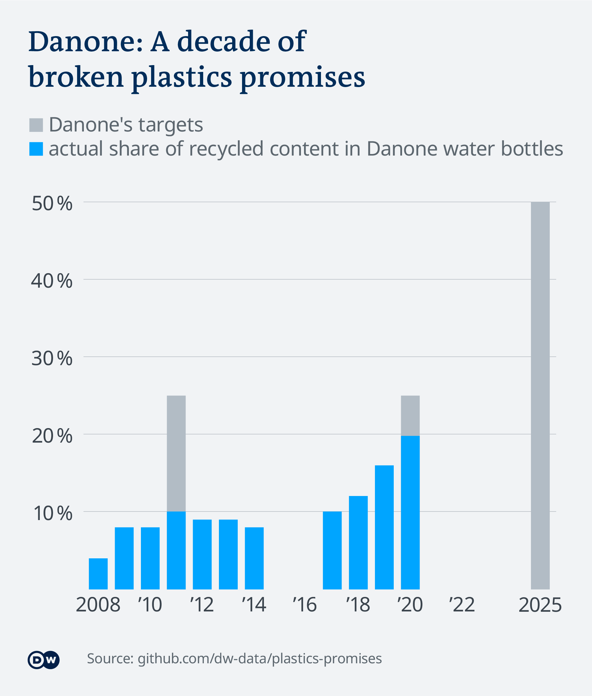

# How European food companies break their plastics promises

  
Two-thirds of pledges to go greener on plastic packaging fail or are dropped, a DW investigation has found. Here's how European food and drink companies break their own commitments, and how legislation might hold them accountable.

This project is a collaboration within the [European Data Journalism Network](https://www.europeandatajournalism.eu/).

**Project lead:** [Deutsche Welle](https://www.dw.com/en/data/t-43091100), research by Julia Merk and Kira Schacht

**Collaborators:** [Alternatives Economiques](https://www.alternatives-economiques.fr/),  [EURACTIV](https://www.euractiv.com/), [Interruptor](https://www.interruptor.pt/), [OBC
Transeuropa](https://www.balcanicaucaso.org/), [Openpolis](https://www.openpolis.it/), [Pod črto](https://podcrto.si/)

*In this repository, you will find methodology, data and code behind this investigation.*

## Read the articles that came out of this collaboration:

Links will be added as articles are published.

- DW: *"European food companies break their plastics promises"* [[English](https://www.dw.com/a-62622509) | [German](https://www.dw.com/a-62622558)]
- European Data Journalism Network: *"European food companies break their plastics promises"* [[English](https://www.europeandatajournalism.eu/eng/News/Data-news/European-food-companies-break-their-plastics-promises)]

# Files

| Name | Content |
|--|--|
| `Plastics Promises Database.xlsx` | The main database used for this project. Also available online as a Google Sheet [here](https://docs.google.com/spreadsheets/d/1nnhW5ZnwL9XSC3AHtRWfLrWwLXs6N0rWfNdJVnWgU9k/edit?usp=sharing). |
| `charts/...` | Graphics featured in this repository |

# Data collection
Much of the data we use is collated from various sources and collected for this project by the collaborators.

To select the companies on which to focus, we compiled a list of the biggest food & drinks companies headquartered in Europe, measured by sales/revenue.

The two sources for this were:
- FoodDrink Europe: [Data & Trends, EU Food & Drink Industry](https://www.fooddrinkeurope.eu/wp-content/uploads/2021/02/FoodDrinkEurope-Data-Trends-2020-digital.pdf) 2020, p. 26 ff.
- Forbes: [The Global 2000](https://www.forbes.com/lists/global2000/?sh=2b5ea7f75ac0) 2021

Partners then added the top 10 companies from their respective country for a closer look. Selection criteria were kept as homogenous as possible, but diverged slightly.

| Region | Criteria |
|--|--|
| Global | global sales |
| Italy | revenue |
| Slovenia | total income from sales |
| Germany | revenue |

For each company, we then searched available records starting from the year 2000 to find any pledges or goals publicly stated relating to plastic packaging, e.g.
- reduction or replacement of plastic packaging
- recycled content
- recyclability
- plastic waste management
- other targets aiming at reducing plastic pollution

We searched the following sources:
-   Company records (Sustainability Reports, Annual Reports)
-   Websites, including archived versions via the [Internet Archive](https://web.archive.org/)
-   Press releases, including archives
-   News articles available online

For each pledge found, we noted the following
| variable | description |
|--|--|
| pledge year | Year the commitment was made |
| goal year | Year of target |
| description | Specific indicator |
| goal | Target value |
| source | Link to source |
| Notes | Further comments |

We then noted the state of reporting in the baseline year mentioned in the promise, and again in the goal year.

# Analysis

For each promise, we evaluated the data as follows:

### Was the promise fulfilled?
| state | description |
|--|--|
| achieved | Pledge achieved |
| failed | Pledge failed |
| unclear | No information found |
| future | Target year is in the future |

Where targets where not verifiable or appeared to be missed, we contacted the company responsible and, where clarification was provided, updated the relevant data. If companies did not comment further on targets, they remained labeled as unclear.

### What is the promise about?

| type | description |
|--|--|
| recycled | Recycled plastics in packaging |
| recyclable | Recyclability of packaging |
| reduce | Reduce total amount or share of plastics / virgin plastics in packaging |
| replace | Replace plastics with other materials in packaging |
| recover | Recover plastic waste for recycling |
| other | Anything else related to plastic packaging |

# Results

## Pledges by status

We found pledges 98 pledges in total, for 24 out of the 56 companies covered in this investigation.

More than half of these pledges were only made in the past few years, with most offering the stated aim of 2025.

In the case of 37 pledges that should have already been delivered on, 68% either clearly failed or were unclear. 

The full database (available as an [Excel file](Plastics Promises Database.xlsx) in this repository or as a [Google Sheet](https://docs.google.com/spreadsheets/d/1nnhW5ZnwL9XSC3AHtRWfLrWwLXs6N0rWfNdJVnWgU9k/edit?usp=sharing)) provides more information about each pledge, including its source and any relevant notes.

## Danone: Promises on recycled PET in water bottles

In the main story, we took a closer look at the French company Danone, who have repeatedly failed their goals on recycled PET in water bottles.

Until 2015, Danone communicated its 2020 goal as referring to global production of water bottles. Later, the company seemed to amend the target to only refer to "countries where it is allowed" to use recycled PET, most often leaving out Turkey and China in calculations. In the amended calculation, Danone would have just reached its 2020 target value, with a reported 25.5% recycled materials in their water bottles in countries where it is allowed.

The chart below, which is also depicted in the article, shows the original ambition communicated in Danone’s reports. The company did not respond to requests for comment on these discrepancies.

Here are the sources behind the chart, listed also in the "Analysis" sheet of the database.

| year | pledge | reality: "where it's allowed" | reality: "worldwide" | source              |
|------|--------|--------------------|-----------|-------------------------------------------------|
| 2008 |        |                 4% |        4% | [SR 2011, p. 156](https://drive.google.com/file/d/1s57bIoPU-kZQf1nUFMVuLpPuexgVWOjr/view) |
| 2009 |    50% |                 8% |        8% | [SR 2014, p. 81](https://drive.google.com/file/d/1awWgJRX1LMAnLW-DbwsYqUfqN29G0obl/view?usp=sharing)                                  |
| 2010 |        |                 8% |        8% | [SR 2014, p. 81](https://drive.google.com/file/d/1awWgJRX1LMAnLW-DbwsYqUfqN29G0obl/view?usp=sharing)                                  |
| 2011 |    25% |                10% |       10% | [SR 2014, p. 81](https://drive.google.com/file/d/1awWgJRX1LMAnLW-DbwsYqUfqN29G0obl/view?usp=sharing)                                  |
| 2012 |        |                 9% |        9% | [SR 2014, p. 81](https://drive.google.com/file/d/1awWgJRX1LMAnLW-DbwsYqUfqN29G0obl/view?usp=sharing)                                  |
| 2013 |        |                 9% |        9% | [SR 2014, p. 81](https://drive.google.com/file/d/1awWgJRX1LMAnLW-DbwsYqUfqN29G0obl/view?usp=sharing)                                  |
| 2014 |        |                 8% |        8% | [SR 2014, p. 81](https://drive.google.com/file/d/1awWgJRX1LMAnLW-DbwsYqUfqN29G0obl/view?usp=sharing)                                  |
| 2015 |        |     -              |    -      | no data available  |
| 2016 |        |                11% |           | [IAR 2016, p. 33](https://drive.google.com/file/d/1IxlcTmbHwAX3u9k-ALLeQEgcTa6JzEfg/view?usp=sharing)                                 |
| 2017 |        |                14% |       10% | [Nature Scorecard 2018, p.5](https://drive.google.com/file/d/1nWks6jVSrFqpRjZ4n53oAQhbJFBDbiIF/view?usp=sharing)                      |
| 2018 |        |                17% |       12% | [Nature Scorecard 2018, p.5](https://drive.google.com/file/d/1nWks6jVSrFqpRjZ4n53oAQhbJFBDbiIF/view?usp=sharing)                      |
| 2019 |        |              20,5% |       16% | [Danone Exhaustive 2020 Environmental Data, p. 5](https://drive.google.com/file/d/1WrsTSWvRNhNrHqK0iaXG4k0H2NbhZz3Q/view) |
| 2020 |    25% |             25,50% |     19,8% | [Danone Exhaustive 2020 Environmental Data, p. 5](https://drive.google.com/file/d/1WrsTSWvRNhNrHqK0iaXG4k0H2NbhZz3Q/view) |
| 2021 |        |                    |           |                                                 |
| 2022 |        |                    |           |                                                 |
| 2023 |        |                    |           |                                                 |
| 2024 |        |                    |           |                                                 |
| 2025 |    50% |                    |           | [Danone Exhaustive 2020 Environmental Data, p. 5](https://drive.google.com/file/d/1WrsTSWvRNhNrHqK0iaXG4k0H2NbhZz3Q/view) |

